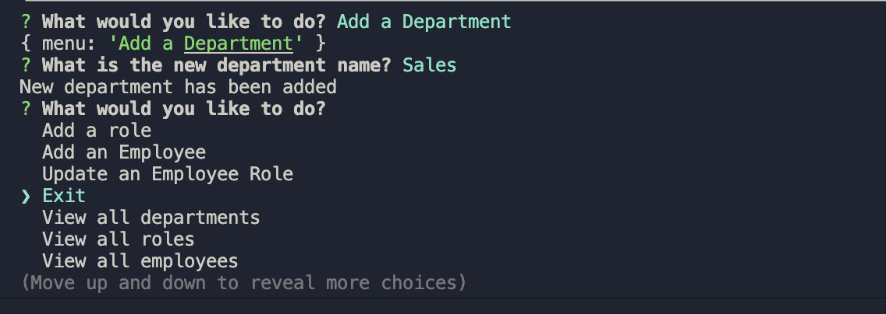

# c-12-CMS-MySQL-Employee-Tracker 

## Description

I created this application so non-developers could view and interact with data stored in a database using an interface called content management systems (CMS). Through the command line, users can manage a company’s employee database. This application uses Node.js, Inquirer, and MySQL.

## Table of Contents (Optional)

- [Installation](#installation)
- [Usage](#usage)
- [Credits](#credits)
- [License](#license)

## Installation

To use this application clone the repo and using your terminal, type in ‘npm install’. Once you have installed the dependencies, change the password located in the server.js file to your MySQL password and save the file. Then sign into MySQL and source the schema.sql file and the seeds.sql file as well. Next, exit MySQL and type in ‘npm start’.

### GitHub Repo:
https://github.com/perfectblue0/c-12-CMS-MySQL-Employee-Tracker

### For a video preview of the basic functionality of this application, visit this link:

## Usage

Once you have completed the aforementioned installation instructions, use the up and down arrow keys to navigate through the menu and press the enter key once you have selected the action you want to complete.  

  

If you choose ‘View all departments’, ‘View all roles’, or ‘View all employees’ a table with the data you requested will appear and below it the main menu will appear so you can choose a different task to complete.  

  

If you choose to ‘Add a Department’, ‘Add a role’, or ‘Add an Employee’ and answer the prompts appropriately, a message will appear saying that whatever data you submitted has been added. There is also an option to update an employee’s role and once you submit the appropriate data, a message will appear that says the employee’s data has been updated and below it you will see the main menu.  

 

To exit the application you can select the ‘Exit’ option on the main menu.  

  

## Credits

I made this project with help from Zoom class recordings where Samantha Randolph, my instructor, demonstrated how to begin the project. I also received help from one-on-one tutoring with Abdullah Al Hilfi. In addition to their support, I used the Zoom recording of the challenge review sessions where Kayvan Kazemini demonstrated how to complete this project.
## License

Please refer to the repo
